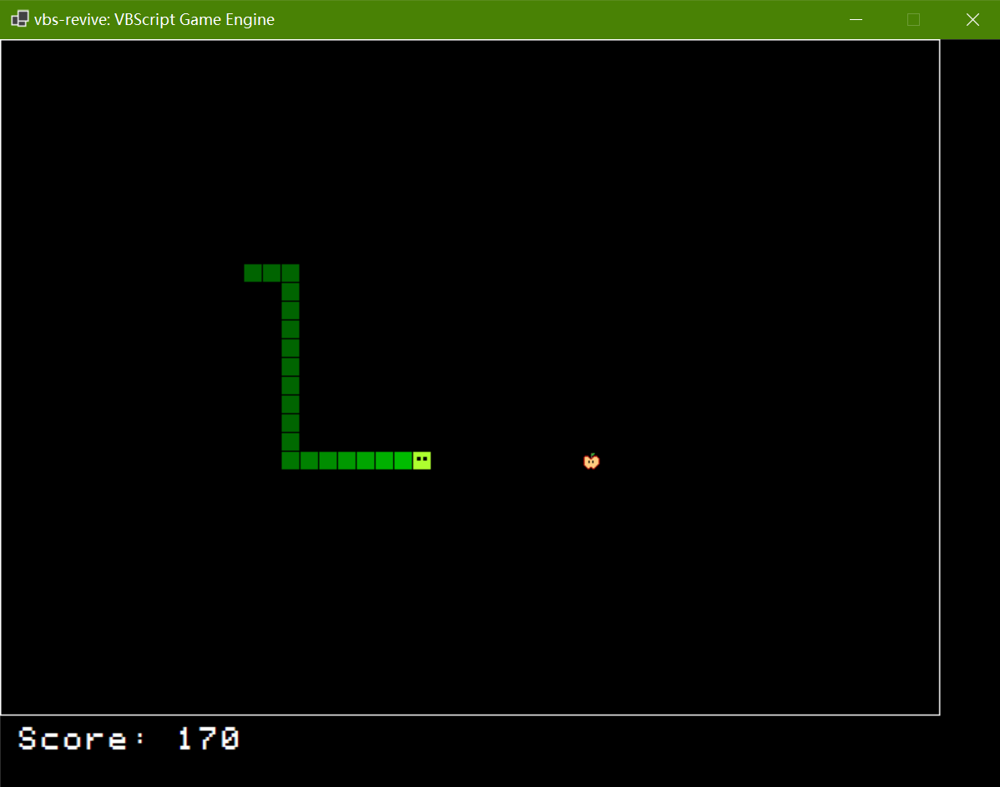

# Snake Game Built with VBScript and `vbs-revive`

A classic Snake game reimagined using VBScript, powered by the VBScript game engine known as [vbs-revive](https://github.com/Pac-Dessert1436/vbs-revive) for modern graphics and audio capabilities. _The game engine is not included in the project and must be downloaded separately._

> **Update on May 25 2026**: Changed `IsKeyHeld` method calls into `IsKeyDown` (maintaining the same functionality), and upgraded the engine's executable to version 1.0.2.



## Features

- 🐍 Classic Snake gameplay with smooth controls
- 🎮 Dual control scheme: Arrow keys and WASD
- 🎵 Background music and sound effects
- 🎨 Modern graphics with gradient snake coloring
- 📊 Score tracking system
- 🔄 Game over screen with restart option

## Requirements

- Windows operating system
- `vbs-revive.exe` (version 1.0.2, stable release)

## How to Play

1. **Download the Game Engine**: Visit the [`vbs-revive` releases page](https://github.com/Pac-Dessert1436/vbs-revive/releases/tag/v1.0.1-stable) to download the game engine.
2. **Run the Game**: Double-click `vbs-revive.exe` to start the game
3. **Controls**:
   - Arrow Keys or WASD to change direction
   - Spacebar to restart after game over
4. **Objective**: Eat the red apples to grow the snake and increase your score
5. **Avoid**: Don't hit the walls or the snake's own body

## Game Mechanics

- **Grid Size**: 50 x 36 cells
- **Cell Size**: 15 pixels
- **Movement Speed**: 0.15 seconds per move
- **Score**: +10 points for each apple eaten

## Project Structure

```
vbscript-snake-game/
├── fonts/
│   └── game_font.ttf          # Game font asset
├── images/
│   └── red_apple.png          # Apple sprite
├── music/
│   └── main_theme.mp3         # Background music
├── sounds/
│   ├── death.wav              # Game over sound
│   └── food.wav               # Apple pickup sound
├── gamemain.vbs               # Main game logic
├── screenshot.png             # Game screenshot
├── LICENSE                    # License file
└── README.md                  # This file
```

## Controls Reference

| Key | Action |
|-----|--------|
| ↑ / W | Move Up |
| ↓ / S | Move Down |
| ← / A | Move Left |
| → / D | Move Right |
| Space | Restart Game |

## Technical Details

- **Language**: VBScript
- **Runtime**: `vbs-revive` (VBScript game engine)
- **Window Size**: 800 x 600 pixels
- **Rendering**: Hardware-accelerated graphics

## License

This project is licensed under the BSD-3-Clause License. See the [LICENSE](LICENSE) file for details.

## Credits

- Built with `vbs-revive` game engine
- Snake gradient effect and eye animation by the developer

Enjoy the game! 🎮